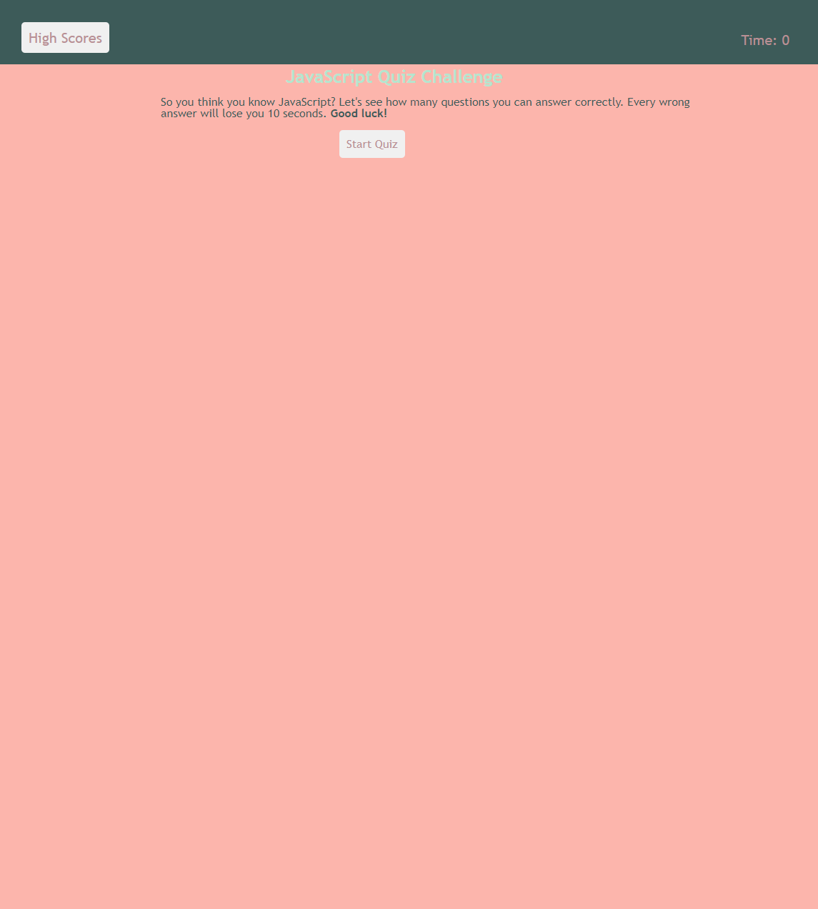
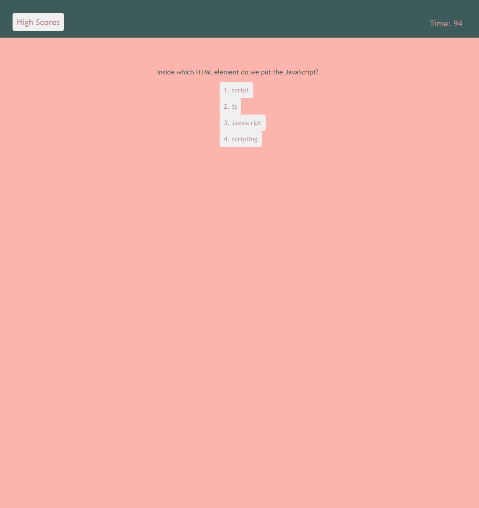
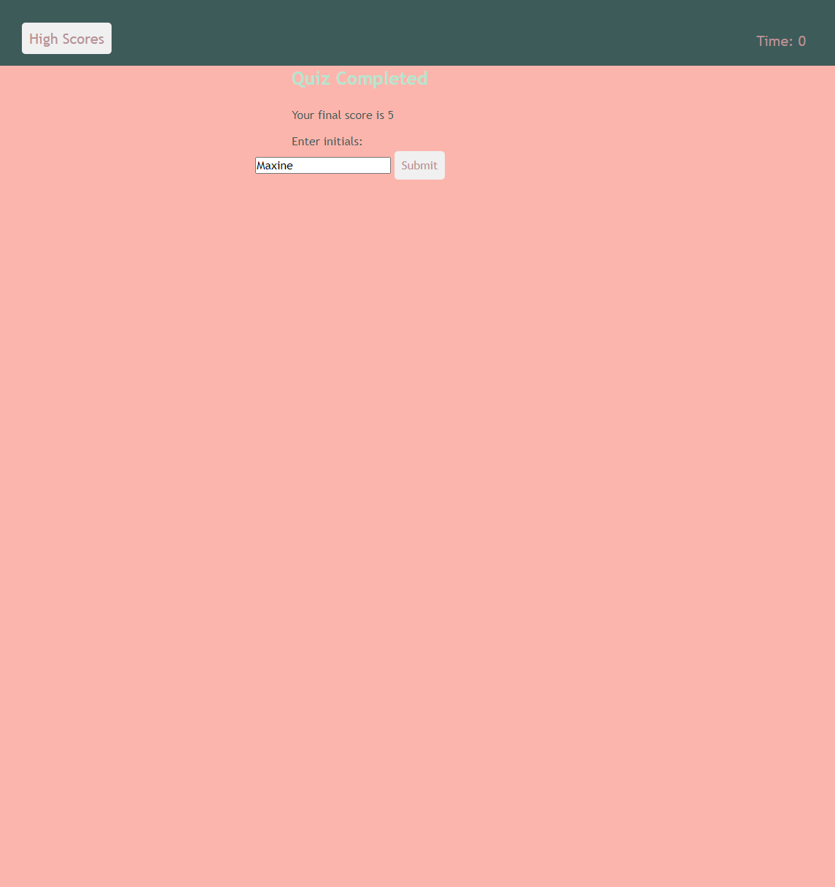
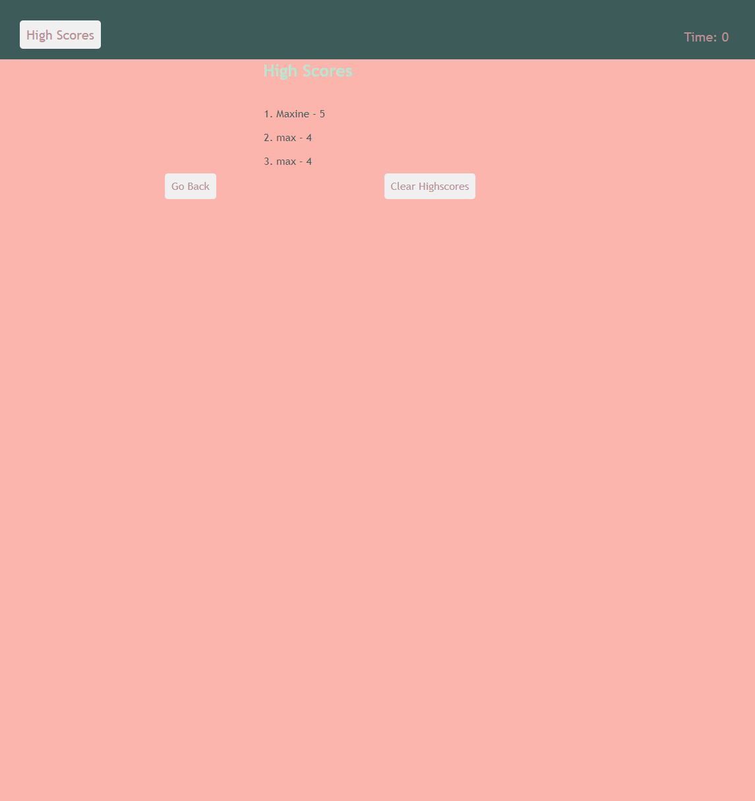

# JavaScript-Quiz

## Created an HTML file.

1. An HTML was structured to have a head and body sections.
2. Website has a unique name.

## Created a CSS file.

1. Styling was added. Fonts, fonts-size, color and positioning.

## Created a JavaScript file.

1. Added code so that when the user interacts with the page and it will react as expected.
2. Added code to start quiz and timer.
3. Added code to store user high scores.

## Completed Webpage

Opening page

Quiz Section

Quiz Complete

High Score page

## Link to website

1. GitHub Repository: https://github.com/Maxie92/JavaScript-Quiz
2. Website: https://Maxie92.github.io/JavaScript-Quiz/